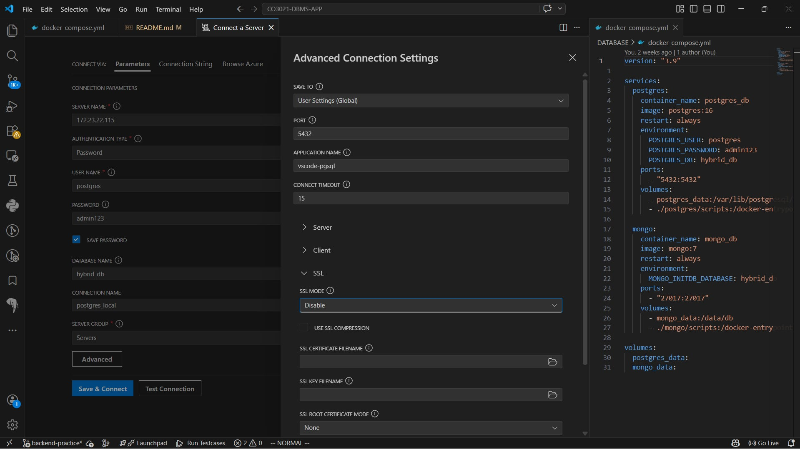

# Hybrid Database System (PostgreSQL & MongoDB)

Dự án này tích hợp song song hai hệ quản trị cơ sở dữ liệu để tối ưu hóa hiệu năng: **PostgreSQL** cho dữ liệu quan hệ (Users, Inventory, Orders) và **MongoDB** cho dữ liệu phi cấu trúc (Product Attributes, Collections).

---

## 📂 Cấu trúc dự án

* `/postgres`: Chứa scripts khởi tạo và công cụ thao tác PostgreSQL.
* `/mongo`: Chứa scripts khởi tạo và công cụ thao tác MongoDB.
* `postgre_seeder.py`: Sinh dữ liệu người dùng và địa chỉ (nạp vào file `05_insert_data.sql`).
* `mongo_seeder.py`: Sinh dữ liệu sản phẩm mẫu cho MongoDB.
* `sync_inventory.py`: Script đồng bộ SKU và tồn kho giữa hai hệ thống.

---

## 🚀 Hướng dẫn khởi chạy nhanh

Chỉ cần sử dụng script tự động để cài đặt mọi thứ:

```bash
chmod +x init.sh clean.sh
./init.sh
```

---

## 🛠 Thao tác thủ công (Nếu cần)

### 1. Khởi động Docker

```bash
docker compose up -d
```

**Lưu ý:**
Nếu đây là lần đầu chạy, PostgreSQL cần nạp dữ liệu từ file `05_insert_data.sql` (nặng).
Hãy dùng lệnh sau để theo dõi tiến độ:

```bash
docker logs -f postgres_db
```

Khi thấy dòng:

```
database system is ready to accept connections
```

→ mới có thể bắt đầu sử dụng.

---

### 2. Thao tác trực tiếp với dữ liệu (Terminal)

Có thể vào thẳng giao diện dòng lệnh của DB thông qua các tool có sẵn:

* **Postgres:**

```bash
./postgres/operate.sh
```

* **Mongo:**

```bash
./mongo/operate.sh
```

Gõ `exit` để thoát.

---

## 🔌 Hướng dẫn kết nối Extension (VS Code)

### PostgreSQL (Extension có hình con voi)

* Authentication Type: Password
* User: `postgres`
* Password: `admin123`
* Database: `hybrid_db`
* Server Name (Host):

  * Nếu dùng Windows + WSL: mở Terminal, gõ:

    ```bash
    hostname -I
    ```

    → lấy địa chỉ IP đầu tiên (ví dụ: `172.x.x.x`)
  * Nếu chạy Linux thuần: dùng `localhost` hoặc `127.0.0.1`



---

### MongoDB (Extension chính chủ MongoDB)

* Chọn **Connect with Connection String**
* Dùng:

```txt
mongodb://127.0.0.1:27017/
```

---

## 🧹 Dọn dẹp dữ liệu

Khi muốn xóa toàn bộ để làm lại từ đầu (bao gồm cả dữ liệu đã lưu trong Database):

```bash
./clean.sh
```

**Lưu ý:**
Luôn dọn dẹp file `05_insert_data.sql` sau khi sử dụng vì nó chiếm dung lượng rất lớn.

---

## 📌 Cách sử dụng các file này

1. Lưu nội dung vào các file tương ứng trong thư mục gốc của dự án.
2. Mở Terminal (WSL/Linux), chạy:

```bash
chmod +x init.sh clean.sh
```

3. Từ nay, mỗi lần muốn bắt đầu dự án, chỉ cần:

```bash
./init.sh
```

### Tóm gọn
- Chạy postgre_seeder.py tạo users, addresses
- Chạy docker tạo server database
- Chờ 10 phút dùng lệnh để xem docker logs -f postgres_db, khi nào thấy có chữ chấp nhận connections là xong
- Trong lúc chờ có thể chạy mongo_seeder.py
- Chạy sync_inventory.py chỉ khi postgreSQL hoàn tất thêm users và addresses
- Chạy order_seeder.py để tạo orders, items, payments, lưu ý shippingAddr lưu ở dạng BJSON để phục vụ snapshot